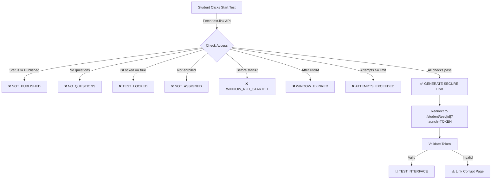

# Test Taking Issues - Troubleshooting Guide

## Problem
You have enrolled in 2 tests but cannot take them as a student.

## Root Causes & Solutions

### 1. **Test Has No Questions Assigned** ⚠️
**Error Message:** "Is test me abhi questions assign nahi hain"

**Why this happens:**
- Admin created a test but didn't assign questions to it
- Test has 0 questions in the database

**Solution:**
- Contact admin to add questions to the test
- Admin needs to assign QuestionIds in test configuration

---

### 2. **Test is Not Published** 🔒
**Error Message:** "NOT_PUBLISHED - This test is not published yet"

**Why this happens:**
- Test status is "Draft" instead of "Published"
- Admin created test but hasn't published it

**Solution for Admin:**
- Go to Admin Dashboard → Tests
- Find the test
- Change status from "Draft" → "Published"
- Save

---

### 3. **Test Window Hasn't Started** ⏰
**Error Message:** "WINDOW_NOT_STARTED - Test window has not started yet"

**Why this happens:**
- Test has a startAt date that is in the future
- Current time < test.startAt

**Example:**
```
Current Time: Feb 26, 2026 10:00 AM
Test Start:   Feb 26, 2026 02:00 PM
Status: Not accessible yet! ❌
```

**Solution:**
- Wait until the start time
- Or admin can update startAt to earlier time

---

### 4. **Test Window Has Expired** ⛔
**Error Message:** "WINDOW_EXPIRED - Test window has expired"

**Why this happens:**
- Test has an endAt date that has passed
- Current time > test.endAt

**Solution:**
- Test is no longer available
- Contact admin to extend endAt date

---

### 5. **You're Not Enrolled in the Test** 🚫
**Error Message:** "NOT_ASSIGNED - This test is not assigned to your batch/course or enrolled test list"

**Why this happens:**
- Student is not in allowedBatchIds
- Student is not in allowedCourseIds  
- Student is not directly enrolled (enrolledTestIds)

**Solution:**
- Contact admin to enroll you in the test
- Admin must add your email to test enrollments

---

### 6. **Attempts Limit Exceeded** 📊
**Error Message:** "ATTEMPTS_EXCEEDED - Attempt limit reached (2/2)"

**Why this happens:**
- You've already taken the test X times
- Test allows only Y attempts (Y < X)

**Solution:**
- If you need more attempts, contact admin
- Admin can increase attemptLimit

---

### 7. **Test is Locked** 🔐
**Error Message:** "TEST_LOCKED - This test is currently locked by admin"

**Why this happens:**
- Admin has locked the test temporarily

**Solution:**
- Contact admin to unlock the test

---

## How to Debug

### Option 1: Use Test Debug Page
1. Go to Student Dashboard
2. Click "Test Debug" button
3. System will show exactly why each test is blocked
4. Share the debug info with your admin

### Option 2: Check These Details
On Student Dashboard, look for each test and check:
- [ ] Does test have questions? (Should show: "X questions")
- [ ] Is test published? (Status should be "Published")
- [ ] Has test started? (Compare current time with "Starts at")
- [ ] Has test expired? (Compare current time with "Ends at")
- [ ] How many attempts left? (Should be > 0)

---

## Common Test Creation Mistakes

### Mistake 1: Forgot to Assign Questions
```
❌ WRONG:
1. Create test
2. Set duration & marks
3. Publish test
(Forgot to add questions!)

✅ CORRECT:
1. Create test
2. Set duration & marks
3. Add questions to questionIds
4. Publish test
```

### Mistake 2: Wrong Start/End Dates
```javascript
❌ WRONG:
startAt: new Date("2026-03-01") // Tomorrow!
endAt: new Date("2026-01-15")   // Yesterday!

✅ CORRECT:
startAt: null // No time restriction
endAt: null   // No time restriction
// OR
startAt: new Date("2026-02-20") // Past date
endAt: new Date("2026-03-15")   // Future date
```

### Mistake 3: Test Not Published
```javascript
❌ WRONG:
status: "Draft" // Not published!

✅ CORRECT:
status: "Published"
```

### Mistake 4: Student Not Enrolled
```javascript
❌ WRONG:
allowedBatchIds: []
allowedCourseIds: []
enrolledTestIds: []
// Student can't access!

✅ CORRECT (pick one):
// Option A: Add to batch
allowedBatchIds: ["batch-123"]

// Option B: Add to course
allowedCourseIds: ["course-123"]

// Option C: Direct enrollment
enrolledTestIds: ["student-email@domain.com"]
```

---

##What Happens During Test Attempt



---

## API Endpoints

### Generate Secure Test Link
```bash
POST /api/student/test-link
Content-Type: application/json

{
  "testId": "test-123"
}

# Response (Success)
{
  "ok": true,
  "url": "/student/test/test-123?launch=TOKEN_HERE",
  "expiresAt": "2026-02-26T12:00:00Z"
}

# Response (Blocked)
{
  "ok": false,
  "code": "NOT_PUBLISHED",
  "message": "This test is not published yet"
}
```

### Validate Secure Token
```bash
POST /api/student/test-link/validate
Content-Type: application/json

{
  "testId": "test-123",
  "token": "TOKEN_HERE"
}

# Response
{
  "ok": true  // Token is valid
}

{
  "ok": false,
  "code": "EXPIRED_TOKEN"  // Token expired
}
```

### Get Test Status (Debug)
```bash
POST /api/debug/test-status
Content-Type: application/json

{
  "testId": "test-123"
}

# Response
{
  "ok": true,
  "access": {
    "allowed": false,
    "reason": "WINDOW_NOT_STARTED",
    "message": "Test window has not started yet"
  },
  "debug": {
    "studentInfo": { ... },
    "testInfo": { ... },
    "enrollmentCheck": { ... },
    "attemptsInfo": { ... }
  }
}
```

---

## Next Steps

1. **Visit Test Debug Page**: `/student/test-debug`
2. **Check specific test**: See exact error and reason
3. **Share with admin**: Provide debug information
4. **Admin fixes issue**: Publish test, add questions, enroll student, etc.
5. **Try again**: You should now be able to take the test

---

## Still Having Issues?

Check these:
- [ ] Browser console (F12) for JavaScript errors
- [ ] Network tab (F12) to see API responses
- [ ] Test ID is correct
- [ ] You're logged in as student (not admin)
- [ ] MongoDB connection is working

Contact your administrator with this information:
- Your email address
- Test ID or test name
- Screenshot of Test Debug page
- Error message (if any)

